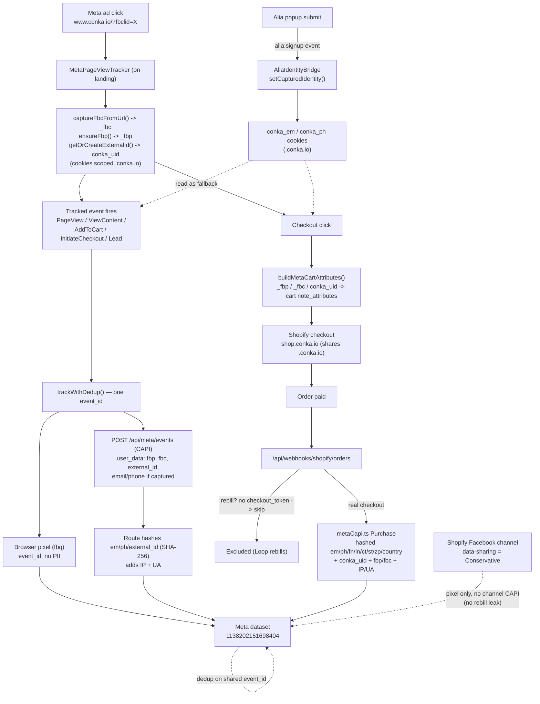

# Analytics & Attribution

Index and current-state overview for how CONKA tracks traffic and attributes conversions. Read this first; it routes to the detailed docs and marks which are current vs superseded.

> **Last verified:** 2026-07-20. If a linked doc contradicts this page, this page wins for "what is live today"; the linked doc holds the detail and history.

---

## Fact-box (what is live today)

| Thing | Value |
|-------|-------|
| Meta pixel / dataset | **`1138202151698404`** ("CONKA Web Traffic") — single pixel, aligned across ads, site, and CAPI |
| Storefront host gate | Pixel + CAPI fire **only on `www.conka.io`** (never preview/localhost) — `isProductionHost()` |
| Checkout | Shopify-hosted on **`shop.conka.io`** (shares the `.conka.io` registrable domain, so identity cookies carry across) |
| Identity cookies (all `.conka.io`) | `_fbc` (ad click), `_fbp` (browser id), `conka_uid` (our `external_id`), `conka_em` / `conka_ph` (Alia capture) |
| Server CAPI | First-party, `app/api/meta/events/route.ts`; browser pixel + server share one `event_id` for dedup; CAPI fires even when the pixel is blocked |
| Purchase | Server-side from the `orders/paid` webhook (`app/api/webhooks/shopify/orders/route.ts`); Loop rebills excluded via `checkout_token` |
| Shopify FB channel | Data-sharing = **Conservative** (pixel only, no channel CAPI) so it cannot fire rebills as Purchases |
| Other systems | Vercel Analytics (funnel events), Triple Whale (client `TriplePixel` only), GA4 (deferred). Klaviyo onsite JS is **disabled**; Alia syncs signups to Klaviyo server-side |

---

## Data-flow: ad click to Purchase

How identity is captured, carried, and deduplicated across the whole funnel.

**The one thing to understand:** `conka_uid` (the `external_id`) is minted on the first pageview and travels on every event *and* onto the order via cart note attributes. That shared id is what lets Meta join a logged-out visitor's anonymous AddToCart to their eventual Purchase. Email/phone (from login or the Alia popup) raise match quality further when present.

---

## Documentation map

### Meta attribution (current)
| Doc | What it covers |
|-----|----------------|
| [META_PIXEL_AND_CAPI.md](META_PIXEL_AND_CAPI.md) | **Canonical implementation reference** — events, `event_id` dedup, server Purchase webhook, `ensureFbp`, env vars, where to get the CAPI token |
| [EMAIL_CAPTURE_ENRICHMENT.md](EMAIL_CAPTURE_ENRICHMENT.md) | Alia popup → CAPI email/phone enrichment (SCRUM-1169), and the Klaviyo/abandoned-cart finding |
| [ATTRIBUTION_STATE_AND_PLAN.md](ATTRIBUTION_STATE_AND_PLAN.md) | Problem framing (match quality / coverage / rebills) and the plan. **See its top banner** — the identity work has since shipped and the "no email for cold traffic" premise is now overtaken by Alia |

### Funnel & product analytics
| Doc | What it covers |
|-----|----------------|
| [FUNNEL_EVENTS.md](FUNNEL_EVENTS.md) | Vercel Analytics funnel taxonomy (`funnel:*`), variant/config properties, the 2-property budget |

### Verification
- Use the **`/review-analytics`** skill to verify all four systems (Vercel, Triple Whale, Meta Pixel, Meta CAPI dedup) fire after any funnel change.
- For a live Meta CAPI spot-check: on `www.conka.io`, watch the `POST /api/meta/events` payload in DevTools (identity present), then confirm coverage/EMQ in Events Manager ~24-48h later (the client CAPI route sends no `test_event_code`, so upper-funnel events do **not** appear in the Test Events tab).

### History & narrative
| Doc | What it covers |
|-----|----------------|
| [HISTORY.md](HISTORY.md) | **Start here for the story** — high-level timeline of what changed, when, and why (including the four Feb-2026 guides removed 2026-07-20, recoverable from git) |
| [HEADLESS_ATTRIBUTION_FIX.md](HEADLESS_ATTRIBUTION_FIX.md) | Dated diagnosis + fix log (domain split, rebill leak, CAPI resilience); some "how wired" tables predate the `shop.conka.io` move |

### Related (not analytics)
- SEO / AEO lives in [`docs/seo-aeo/`](../seo-aeo/README.md), including the Search Console baseline.

---

## Key files

| File | Purpose |
|------|---------|
| `app/lib/metaPixel.ts` | Client hub — `event_id`, `trackWithDedup`, cookie helpers, `ensureFbp`, `getOrCreateExternalId`, `setCapturedIdentity`, `buildMetaCartAttributes` |
| `app/api/meta/events/route.ts` | CAPI relay — hashes `em`/`ph`/`external_id`, adds IP/UA, forwards to Meta |
| `app/api/webhooks/shopify/orders/route.ts` | Server Purchase — rebill exclusion via `checkout_token`, sends via `metaCapi.ts` |
| `app/lib/metaCapi.ts` | Server hashing + Purchase send (`hashNormalized`, `hashPhone`) |
| `app/components/AliaIdentityBridge.tsx` | Listens for `alia:signup`, persists captured email/phone |
| `app/components/MetaPageViewTracker.tsx` | Fires PageView, captures `_fbc`/`_fbp` on landing |
| `app/lib/analytics.ts` | Vercel Analytics events |
| `app/lib/tripleWhale.ts` | Triple Whale AddToCart |
