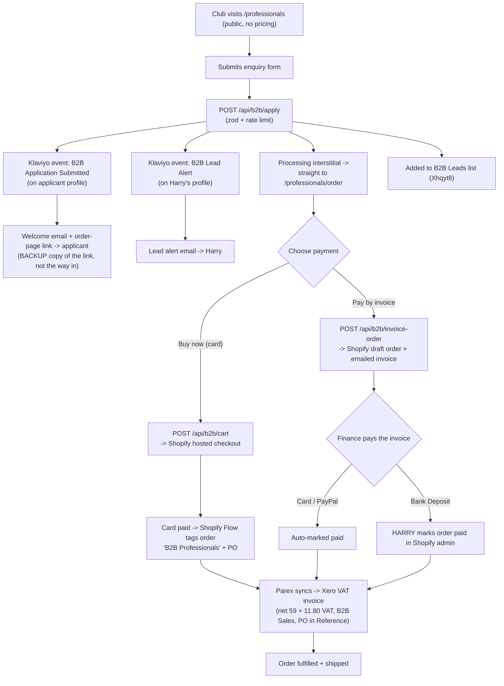

# B2B Professionals Portal

Live bulk-ordering channel for UK sports clubs and performance orgs at `/professionals`. Public enquiry → unlisted tiered-pricing page → two payment paths (card now / pay by invoice), both shipping only after confirmed payment. Almost no commerce plumbing is custom: Shopify handles the order, payment, VAT, shipping, and fulfilment; an off-the-shelf connector (Parex) books every paid order into Xero; Klaviyo sends the transactional emails. There is no custom checkout, no payment processor, no bespoke Xero build, and no database.

> Status: **live and pilot-proven** (both payment paths verified end to end into Xero, 8 Jun 2026). This is the single canonical reference for the B2B channel: what exists, why, and what is left to explore. The five former `featurePlans/b2b-*.md` docs (portal build, Xero/VAT, conversion upgrade, consolidated status) were folded into this doc on 12 Jun 2026; their blow-by-blow build history remains in git.

## Overview

- **Who it serves:** procurement and performance staff at UK clubs. Warm, sales-led traffic (Harry-shared links), not cold paid.
- **What it does:** lets a club self-serve a bulk order of CONKA Flow / Clear at quantity-break pricing, paying by card immediately or by invoice on terms, and produces a compliant UK VAT invoice in Xero automatically.
- **High order values:** a 50+ box order is roughly GBP 2,250 ex VAT.

## User journey and our touchpoints

**Touchpoint legend:** every node is automatic **except** the one marked **HARRY** (marking a bank-transfer order paid). The lead alert (`H`) is informational, not a required action. Everything else is self-serve.

## How it works

**Site (this repo).** Three React surfaces and three API routes under `/professionals`:
1. **Public landing + enquiry form** (`/professionals`). No pricing. Submits to `/api/b2b/apply`. Expanded into sales collateral (see [Conversion & credibility](#conversion--credibility)).
2. **Unlisted order page** (`/professionals/order`). `noindex`, not in nav, permanent shareable link. Two Flow/Clear steppers, live combined-total tier pricing (display only), tier table + next-tier nudge, PO + finance-email fields, both payment CTAs.
3. **API routes** that hand off to Shopify and Klaviyo. The site never holds card data or order state; it builds Shopify carts / draft orders and redirects.

**Checkout is Shopify-hosted.** No custom checkout. Card path builds a Shopify cart → `cart.checkoutUrl`; invoice path creates a Shopify draft order and Shopify emails the hosted invoice. All money, VAT, shipping, refunds, receipts are Shopify's.

**Emails are Klaviyo flows, not sent from code.** `/api/b2b/apply` only fires events and subscribes the profile; the two emails are flows configured in the Klaviyo dashboard ([details](#klaviyo-emails--leads)).

**Entry to the order page is immediate, not email-gated** (SCRUM-1137, 13 Jul 2026). On submit the applicant sees a short processing interstitial (`B2BProcessingInterstitial`, modelled on the quiz's `AnalyzingView`) covering the real API call, then goes straight to `/professionals/order`. The welcome email is a **backup copy of the link** for the finance team, not the way in. A Klaviyo failure therefore never blocks a club from ordering: the route logs loudly and lets them through. Previously the whole lead hung on one email surviving spam filters.

**There is deliberately no honeypot.** The original one was a hidden field named `company`, which Chrome's autofill mapped to the organisation field and filled on the applicant's behalf; the route then silently discarded the application. It ran for a month and binned every autofilled lead. Any field a browser can recognise is a field a browser will fill, so do not reintroduce one. The per-IP rate limit is the spam defence.

**Invoicing is an off-the-shelf connector.** Every paid B2B order syncs to Xero as a compliant VAT invoice via **Parex (Xero Bridge)**, scoped to the `B2B Professionals` tag so it never touches DTC accounting. No Xero API code in this repo.

## Key files

| File | Purpose |
|------|---------|
| `app/professionals/page.tsx` | Public landing: enquiry form + conversion sections + regular-supply mailto |
| `app/professionals/order/page.tsx` | Unlisted (`noindex`) order page wrapper |
| `app/components/b2b/ApplicationForm.tsx` | Enquiry form. Required-field gating, posts to `/api/b2b/apply`, then interstitial + redirect to the order page. **No honeypot** (see above) |
| `app/components/b2b/B2BProcessingInterstitial.tsx` | Processing steps shown over the in-flight submit before the order page. Content-only, reduced-motion aware |
| `app/components/b2b/B2BOrderBuilder.tsx` | Order builder: steppers, live pricing, tier table + next-tier nudge, PO + finance email, both CTAs |
| `app/components/b2b/PilotProgramme.tsx` | Pilot-programme USP section (Starter / In-depth formats, mailto-to-Harry CTA) |
| `app/components/b2b/B2BValueCallout.tsx` | Per-athlete-per-day value band (ex VAT, `pricePerBox / 28`) |
| `app/components/b2b/TeamFAQ.tsx` | Progressive-disclosure FAQ (`
`) |
| `app/components/InformedSportCertification.tsx` | Anti-doping cert block (extracted from `AthleteCredibilityCarousel`, reused on landing + home + PDPs) |
| `app/api/b2b/apply/route.ts` | Enquiry endpoint. zod, honeypot, rate limit, calls `b2bEmail` |
| `app/api/b2b/cart/route.ts` | Card path: builds a Storefront cart, returns `checkoutUrl` |
| `app/api/b2b/invoice-order/route.ts` | Invoice path: `draftOrderCreate` (+ shipping line) + `draftOrderInvoiceSend` via Admin API |
| `app/lib/b2bData.ts` | Sport list, squad-size bands, **Klaviyo contract** (`B2B_KLAVIYO`), shared `EMAIL_RE` |
| `app/lib/b2bPricing.ts` | Display tiers + helpers (`getB2BTier`, `getB2BGrossPerBox`, `getB2BNextTier`, `B2B_VAT_RATE`). **Display maths only** |
| `app/lib/b2bShipping.ts` | UK freight bands for the invoice draft order (`getB2BShippingPrice`, `B2B_SHIPPING_TITLE`). Mirrors the live UK Express bands |
| `app/lib/b2bVariants.ts` | Shopify variant GIDs for Flow + Clear. **In-code constants**, server-only |
| `app/lib/b2bEmail.ts` | Fires the two Klaviyo events + adds applicant to the B2B Leads list |
| `app/lib/shopifyAdmin.ts` | Admin API helper (`adminGraphql`, `isAdminApiConfigured`). Storefront `shopify.ts` cannot create draft orders |
| `app/lib/rateLimit.ts` | Shared in-memory per-IP limiter used by all three B2B routes |

## API endpoints

All `runtime = "nodejs"`, all validate with zod, all return JSON `{ error }` on failure.

| Method | Endpoint | Body | Does |
|--------|----------|------|------|
| POST | `/api/b2b/apply` | enquiry fields | Fires `B2B Application Submitted` (applicant) + `B2B Lead Alert` (Harry) events, adds to B2B Leads list. Returns `success` once the submission is **received**: a Klaviyo failure is logged, never surfaced, so the applicant is never blocked from the order page. Rate limit 5/10min |
| POST | `/api/b2b/cart` | `lines[{product, quantity}]`, `poNumber?` | Creates a Shopify cart (PO + `Order Type` as cart attributes), returns `checkoutUrl`. Rate limit 10/10min |
| POST | `/api/b2b/invoice-order` | `lines`, `financeEmail`, `poNumber` (required) | Creates a draft order at the gross tier price + UK freight line + emails the invoice. PO into note + tag + attribute. Rate limit 5/10min. 503 if Admin token unset |

## Pricing and VAT

**Combined-total tiers.** The Flow + Clear box total picks the tier; that per-box price applies to every box. Shopify discounts trigger on total cart quantity across the collection, not per variant (so a club mixing 30 Flow + 20 Clear gets the 50-box rate).

| Tier | Boxes | Net (ex VAT) | Gross (inc 20%) |
|------|-------|--------------|-----------------|
| Entry | 1-24 | GBP 59 | GBP 70.80 |
| Squad | 25-49 | GBP 52 | GBP 62.40 |
| Institutional | 50+ | GBP 45 | GBP 54.00 |

- **Variants are priced at the gross Entry rate (GBP 70.80).** A Shopify discount can only reduce a price, so the base is the highest gross.
- **Card path pricing** = Shopify automatic discounts on the `B2B Products` collection (Squad −GBP 8.40/box, Institutional −GBP 16.80/box, no stacking). The order page mirrors the maths **for display only** — page total and charged total are computed independently, so `b2bPricing.ts` and the Shopify discounts must be kept in lockstep.
- **Invoice path pricing** is set on the draft order: line items at the gross base + an order-level `FIXED_AMOUNT` discount down to the gross tier total (`getB2BGrossPerBox`). Needs no Shopify discount config.
- **VAT — Road B (live, pilot-proven).** Shopify collects UK VAT at 20% **inclusive** (VAT no. GB430507628, "include tax in prices" ON, so no consumer price changed). Parex **mirrors** whatever tax Shopify charged onto the Xero invoice — it does **not** derive VAT itself. So the Xero invoice reads net 59 + 11.80 VAT = 70.80 gross. *(Road A — leave Shopify VAT off and let the connector "split" the gross — was abandoned: the vendor confirmed in writing the connector passes NO VAT when Shopify charges none, which would book every B2B invoice at 0% / non-compliant.)*
- **Pricing is ex-VAT by commercial choice** (club pays gross, reclaims the VAT) because trade buyers read ex-VAT prices.

## Shipping

B2B is the **same physical SKUs as DTC**, so it inherits the **global weight-banded Shopify rates** (UK `Express` free to 6 boxes, then £12 / £25 / £50 / £75; full tables in `docs/shipping/SHIPPING_AND_COURIERS.md`). 1 box = 2.1 kg, so box count maps 1:1 onto the weight tiers.

- **Card path:** freight comes from the live Shopify rate table automatically.
- **Invoice path:** draft orders **never pull the Shopify rate table**, so the route applies a UK freight line explicitly from `b2bShipping.ts` (`getB2BShippingPrice`, same band numbers), titled `Express` (Synergy routes on the method name). Always attached even at £0 — a blank method can't be routed. UK-only by design (no delivery address exists when the draft is created, and there's no international carrier rate above 6 boxes).
- **Pallet-scale (>~60 boxes):** handled manually — Harry adds a `Pallet` line to the draft before sending (playbook: `SHIPPING_AND_COURIERS.md` §7). A pallet only beats parcels above ~60 boxes.

## Conversion & credibility

The `/professionals` landing was expanded from a thin hero + form into sales collateral that does Harry's selling (warm, sales-led traffic = enablement, not top-of-funnel CRO). Shipped:

- **Anti-doping certification trust strip** (`InformedSportCertification`, extracted so home + the three PDPs are untouched) — the strongest B2B trust signal, placed high.
- **Pilot-programme USP section** (`PilotProgramme`) — Starter (2-week) and In-depth (4-6-week, with a 2-week baseline) formats, "prove it on your own squad first" de-risk framing, mailto-to-Harry CTA. No invented credit terms.
- **Order-page pricing clarity** — per-box-anchored tier table with a "you save" column and a live "N boxes from the next tier" nudge (`getB2BNextTier`).
- **Per-athlete-per-day value band** (`B2BValueCallout`) — reframes the order total as a small daily per-head cost (ex VAT, `pricePerBox / 28`, labelled "on one format" so a Both athlete isn't double-counted).
- **Progressive-disclosure FAQ** (`TeamFAQ`).

Athlete proof stays supporting context (no club crests, kit, stadium imagery, or "trusted by [team]" — implied-endorsement line). See [Future work](#future-work--to-explore) for the unbuilt parts (social proof, nav, analytics).

## External tools and config (not in this repo)

| Tool | Role | Key config |
|------|------|-----------|
| **Shopify checkout** | Card payment, VAT, shipping, refunds | Hosted; `cart.checkoutUrl` |
| **Shopify `B2B Products` collection** | Targets the automatic discounts | Manual collection, 2 products, headless-only (unpublished from Online Store) |
| **Shopify automatic discounts** | Card-path tier pricing | "Amount off products", per-item, combined min-quantity, no stacking |
| **Shopify UK VAT** | Charges the 20% Parex mirrors | Collecting, GB430507628, inclusive pricing |
| **Shopify Flow** | Tags card orders into Parex scope | On order created, if `Order Type = B2B Professionals` → add `B2B Professionals` tag + `PO <value>` tag |
| **Shopify Admin API** | Draft-order creation | Custom app "CONKA B2B Invoicing", offline token, scopes `write_draft_orders` + `write_customers` |
| **Shopify Bank Deposit** | Bank-transfer payment option | Manual payment method, CONKA bank details, "use PO as reference" |
| **ETP "Hide & Sort Payments"** | Scopes Bank Deposit to B2B | Rule: hide Bank Deposit unless cart has a `B2B Products` item |
| **Klaviyo** | Transactional emails + lead list | See below |
| **Parex (Xero Bridge)** | Per-order Shopify → Xero invoices | Silver plan ($15/mo), scoped to `B2B Professionals` tag, `B2B Sales` account, 20% VAT on Income, order Note → invoice Reference, Auto Sync ON |

### Klaviyo (emails + leads)

- **B2B Leads list:** `Xhqyt8`. Every applicant is added.
- **Flow `B2B Applicant Welcome`** triggers on `B2B Application Submitted` (on the applicant's profile) and emails the order-page link (`{{ event.order_url }}`).
- **Flow `B2B Lead Alert`** triggers on `B2B Lead Alert` and emails Harry the applicant's details.
- **The Harry-notification trick:** a Klaviyo flow email always sends to the profile that triggered it. To reach Harry not the applicant, the apply route fires a **second** event (`B2B Lead Alert`) **on Harry's own profile** (`$email = B2B_KLAVIYO.notifyEmail`), carrying the applicant's details as event properties.
- Both flows must have **Smart Sending OFF** (service emails) and re-entry allowed. Emails land in Gmail's **Updates** tab.

## Configuration: env vs constants

Deliberately minimal env footprint — only genuine secrets and per-environment values are env.

| Value | Where | Why |
|-------|-------|-----|
| `SHOPIFY_ADMIN_API_TOKEN` | **env** | Secret. Gates the invoice path (`isAdminApiConfigured`) |
| `NEXT_PUBLIC_SITE_URL` | **env** | Per-environment; builds the welcome-email order link. Falls back to `https://conka.io` |
| `KLAVIYO_PRIVATE_KEY`, `NEXT_PUBLIC_KLAVIYO_PUBLIC_KEY` | **env** (pre-existing) | Klaviyo API auth |
| Shopify Flow/Clear variant GIDs | **constant** `B2B_VARIANTS` (`b2bVariants.ts`) | Not secret, one prod store |
| Klaviyo list id + alert recipient | **constant** `B2B_KLAVIYO` (`b2bData.ts`) | One Klaviyo account, not secret |

Card "Buy now" needs nothing in Vercel. Pay-by-invoice needs `SHOPIFY_ADMIN_API_TOKEN` set.

## Decisions and trade-offs

- **No Stripe / no custom checkout.** DTC already uses Shopify checkout; a second stack adds run-cost and zero capability.
- **Unlisted noindex URL, no tokenised access.** The only reason to hide trade pricing is channel conflict; a shared noindex link solves that at zero per-user run cost.
- **Combined-total tiers (Flow+Clear), not per-product.** Mixed orders deserve the bulk rate.
- **Pay-by-invoice via Shopify draft orders.** One Admin API call = a payable, emailable invoice; "mark as paid" converts it to a real order — no custom billing.
- **Off-the-shelf Xero connector, not a bespoke API.** Owning OAuth, refresh, idempotent webhooks, account mapping forever has no payoff at this volume.
- **Ship only after confirmed payment, both paths.** Zero credit risk; no Net-30 (yet — see Future work).
- **Dedicated `/api/b2b/cart` (not `CartContext`).** B2B needs multiple lines in one cart, keeps variant GIDs server-side, and stays isolated from a shopper's persisted DTC cart.
- **VAT Road A → Road B** (see Pricing): the connector mirrors Shopify's tax and can't invent it, so Shopify must charge the VAT.

## Edge cases and error handling

- **Admin token unset:** invoice route returns a clean 503 "not available yet" rather than a broken draft order. Card path has no such gate (variant GIDs are constants).
- **Invoice created but email send fails:** route returns a partial-success 502 with the `draftOrderName` so Harry can resend.
- **Klaviyo partial failure:** never blocks the applicant. They still reach the order page; the route `console.error`s which of `event` / `alert` / `list` failed, with the applicant's email, so the lead can be recovered by hand from the Vercel logs. This log line is the only signal we get, and its absence is what hid SCRUM-1137 for a month.
- **Spam:** per-IP rate limits on all three routes. **No honeypot, by design** (see How it works).
- **Autofill (the SCRUM-1137 bug):** browsers fill any field they recognise, including hidden ones. Never add a field to this form whose name or label a browser could map to a real one, and never silently drop a submission. If a submission is rejected, say so.
- **PO mapping to Xero:** PO rides in the order note, a sanitized tag, and a custom attribute, because connectors read note/tag, not custom attributes. Card orders carry the PO via the Shopify Flow tag (the Storefront cart cannot set a note).
- **Pilot-proven (8 Jun 2026):** one invoice order (#3514) and one card order (#3517) each produced exactly one Xero invoice, £59 net + £11.80 VAT, `B2B Sales`, PO in Reference, zero DTC orders synced. PO→Reference confirmed both paths (card carries it via the Flow tag even with an empty note).

## Future work / to explore

Captured here so it lives with the feature, not in a separate plan doc:

- **B2B social proof section.** Anonymised club outcomes (role + sport + squad band + KPI), aggregate counts, category/sport badges, reframed athlete usage-in-context. **Gated on real, sign-off-ready figures — placeholders must not ship.**
- **Nav reachability + section analytics.** Make `/professionals` nav-linked when ready (warm-traffic collateral today), and add light section-engagement events alongside the existing `b2b_checkout_started` / `b2b_invoice_requested`.
- **B2B → Synergy fulfilment consolidation.** B2B products are still tagged `SYNERGYIGNORE` and fulfil from Burnside; only the 3 funnel SKUs go to Synergy. Plan: re-point B2B off its archived legacy variants onto the funnel variants (`FLOW/CLEAR-FUNNEL-28`) so B2B fulfils from Synergy on the confirmed courier economics. Touches `b2bVariants.ts`, both B2B API routes, and the discount targeting; needs Synergy stock planning. Tracked as Phase 3 of `order-size-shipping-tiers.md`. Do on aligned timing — it rewires a live portal.
- **Net-30 / pay-on-terms.** Discovery only, not green-lit (Harry raised). The lift is financial/operational risk, not technical (Shopify does Payment Terms natively). If pursued: manual, trusted-clubs-only, and it sits on top of the fulfilment-routing question, so sequence after Synergy consolidation.
- **US B2B shipping.** US is currently flat £22 (the real USD / scaled / DDP build is separate and unstarted), so a large US B2B order under-charges freight.
- **Close-out checks.** Set `NEXT_PUBLIC_SITE_URL` in Vercel so the welcome email links to prod (not the code fallback); confirm the pilot test orders (#3513/3514/3516/3517) are cleaned out of Xero so `B2B Sales` starts clean; confirm card-settled orders (Shopify Payments) reconcile against Parex's Revolut-deposit assumption.

## Related docs

- Shipping & couriers (weight bands, carrier costs, pallets): `docs/shipping/SHIPPING_AND_COURIERS.md`
- Order-size shipping tiers + B2B→Synergy consolidation plan: `docs/development/featurePlans/order-size-shipping-tiers.md`
- Synergy 3PL: `docs/development/featurePlans/synergy-3pl-integration.md`
- Klaviyo patterns: `docs/features/KLAVIYO_FLOWS_AND_INTEGRATION.md`
- DTC cart: `docs/features/CART_LOGIC.md`
