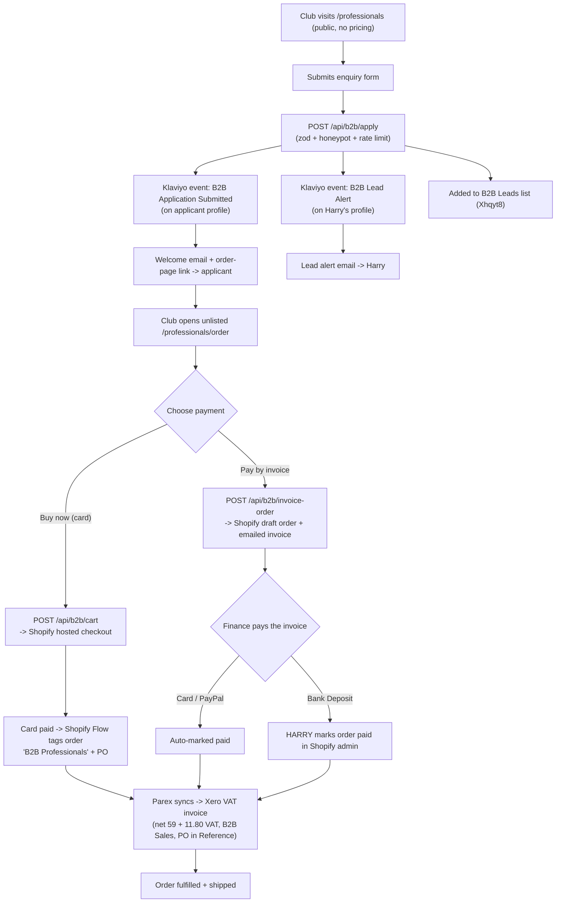

# B2B Professionals Portal

Live bulk-ordering channel for UK sports clubs and performance orgs at `/professionals`. Public enquiry → unlisted tiered-pricing page → two payment paths (card now / pay by invoice), both shipping only after confirmed payment. Almost no commerce plumbing is custom: Shopify handles the order, payment, VAT, and fulfilment; an off-the-shelf connector (Parex) books every paid order into Xero; Klaviyo sends the transactional emails. There is no custom checkout, no payment processor, no bespoke Xero build, and no database.

> Status: **live**. This doc describes what is actually running. The build history, decisions, and pilot records live in the plan docs: `docs/development/featurePlans/b2b-professionals-portal.md` (portal) and `docs/development/featurePlans/b2b-xero-invoicing.md` (Xero + VAT). This doc is the current-state reference; those are the archaeology.

## Overview

- **Who it serves:** procurement and performance staff at clubs. Warm, sales-led traffic, not cold paid.
- **What it does:** lets a club self-serve a bulk order of CONKA Flow / Clear, at quantity-break pricing, paying by card immediately or by invoice on terms, and produces a compliant UK VAT invoice in Xero automatically.
- **High order values:** a 50+ box order is roughly GBP 2,250 ex VAT.

## User journey and our touchpoints

**Touchpoint legend:** every node is automatic **except** the one explicitly marked **HARRY** (marking a bank-transfer order paid). The lead alert (`H`) is informational, not a required action. Everything else is self-serve.

## How it works

### Site (this repo)

Three React surfaces and three API routes, all under `/professionals`:

1. **Public landing + enquiry form** (`/professionals`). No pricing. On submit, the form POSTs to `/api/b2b/apply`.
2. **Unlisted order page** (`/professionals/order`). `noindex`, not in nav, permanent shareable link. Two Flow/Clear quantity steppers, live combined-total tier pricing (display only), a PO field, a finance-email field, and the two payment CTAs.
3. **API routes** that hand off to Shopify and Klaviyo (see below). The site never holds card data or order state; it builds Shopify carts / draft orders and redirects.

### Checkout is Shopify-hosted

There is no custom checkout. The card path builds a Shopify cart and redirects to `cart.checkoutUrl`; the invoice path creates a Shopify draft order and Shopify emails the hosted invoice. All money, VAT, shipping, refunds, and receipts are Shopify's.

### Emails are Klaviyo flows, not sent from code

`/api/b2b/apply` only **fires events** and subscribes the profile. The two emails are **flows configured in the Klaviyo dashboard**, keyed off those events. See [Klaviyo](#klaviyo-emails--leads).

### Invoicing is an off-the-shelf connector

Every paid B2B order is synced to Xero as a compliant VAT invoice by **Parex (Xero Bridge)**, scoped to the `B2B Professionals` tag so it never touches DTC accounting. No Xero API code in this repo.

## Key files

| File | Purpose |
|------|---------|
| `app/professionals/page.tsx` | Public landing page + enquiry form section + regular-supply mailto CTA |
| `app/components/b2b/ApplicationForm.tsx` | Enquiry form. Required-field gating, honeypot, posts to `/api/b2b/apply` |
| `app/api/b2b/apply/route.ts` | Enquiry endpoint. zod validation, honeypot, rate limit, calls `b2bEmail` |
| `app/lib/b2bEmail.ts` | Fires the two Klaviyo events + adds applicant to the B2B Leads list |
| `app/lib/b2bData.ts` | Sport list, squad-size bands, **Klaviyo contract** (`B2B_KLAVIYO`: list id, notify email, event names), shared `EMAIL_RE` |
| `app/professionals/order/page.tsx` | Unlisted (`noindex`) order page wrapper |
| `app/components/b2b/B2BOrderBuilder.tsx` | Order builder UI: steppers, live pricing, PO + finance email, both CTAs |
| `app/lib/b2bPricing.ts` | Display tiers + helpers (`getB2BTier`, `getB2BGrossPerBox`, `B2B_VAT_RATE`). **Display maths only** |
| `app/lib/b2bVariants.ts` | Shopify variant GIDs for Flow + Clear. **In-code constants**, server-only |
| `app/api/b2b/cart/route.ts` | Card path: builds a Storefront cart, returns `checkoutUrl` |
| `app/api/b2b/invoice-order/route.ts` | Invoice path: `draftOrderCreate` + `draftOrderInvoiceSend` via Admin API |
| `app/lib/shopifyAdmin.ts` | Admin API helper (`adminGraphql`, `isAdminApiConfigured`). Storefront `shopify.ts` cannot create draft orders |
| `app/lib/rateLimit.ts` | Shared in-memory per-IP limiter used by all three B2B routes |

## API endpoints

All `runtime = "nodejs"`, all validate with zod, all return JSON `{ error }` on failure.

| Method | Endpoint | Body | Does |
|--------|----------|------|------|
| POST | `/api/b2b/apply` | enquiry fields + `company` honeypot | Fires `B2B Application Submitted` (applicant) + `B2B Lead Alert` (Harry) events, adds to B2B Leads list |
| POST | `/api/b2b/cart` | `lines[{product, quantity}]`, `poNumber?` | Creates a Shopify cart (PO + `Order Type` as cart attributes), returns `checkoutUrl`. Rate limit 10/10min |
| POST | `/api/b2b/invoice-order` | `lines`, `financeEmail`, `poNumber` (required) | Creates a draft order at the gross tier price + emails the invoice. PO into note + tag + attribute. Rate limit 5/10min. 503 if Admin token unset |

## Pricing and VAT

- **Combined-total tiers.** The Flow + Clear box total picks the tier; that per-box price applies to every box. So Shopify discounts must trigger on **total cart quantity across the collection**, not per variant.

  | Tier | Boxes | Net (ex VAT) | Gross (inc 20%) |
  |------|-------|--------------|-----------------|
  | Entry | 1-24 | GBP 59 | GBP 70.80 |
  | Squad | 25-49 | GBP 52 | GBP 62.40 |
  | Institutional | 50+ | GBP 45 | GBP 54.00 |

- **Variants are priced at the gross Entry rate (GBP 70.80).** A Shopify discount can only reduce a price, so the base must be the highest gross.
- **Card path pricing** comes from **Shopify automatic discounts** on the `B2B Products` collection (Squad -GBP 8.40/box, Institutional -GBP 16.80/box, no stacking). The order page mirrors the maths **for display only** — the page total and the charged total are computed independently, so the tier numbers in `b2bPricing.ts` and the Shopify discounts must be kept in lockstep.
- **Invoice path pricing** is set on the **draft order**: line items at the gross base + an order-level `FIXED_AMOUNT` discount down to the gross tier total (`getB2BGrossPerBox`). This path needs **no** Shopify discount config.
- **VAT (Road B).** Shopify collects UK VAT at 20% **inclusive** (VAT no. GB430507628, "include tax in prices" ON, so no consumer price changed). Parex **mirrors** whatever tax Shopify charged onto the Xero invoice (it does not derive VAT itself). So the Xero invoice reads net 59 + 11.80 VAT = 70.80 gross.

## External tools and config (not in this repo)

| Tool | Role | Key config |
|------|------|-----------|
| **Shopify checkout** | Card payment, VAT, shipping, refunds | Hosted; `cart.checkoutUrl` |
| **Shopify `B2B Products` collection** | Targets the automatic discounts | Manual collection, 2 products, headless-only (unpublished from Online Store) |
| **Shopify automatic discounts** | Card-path tier pricing | "Amount off products", per-item, combined min-quantity, no stacking |
| **Shopify UK VAT** | Charges the 20% Parex mirrors | Collecting, GB430507628, inclusive pricing |
| **Shopify Flow** | Tags card orders into Parex scope | On order created, if `Order Type = B2B Professionals` → add `B2B Professionals` tag + `PO <value>` tag |
| **Shopify Admin API** | Draft-order creation | Custom app "CONKA B2B Invoicing", offline token, scopes `write_draft_orders` + `write_customers` |
| **Shopify Bank Deposit** | Bank-transfer payment option | Manual payment method, CONKA bank details, "use PO as reference" |
| **ETP "Hide & Sort Payments"** | Scopes Bank Deposit to B2B | Rule: hide Bank Deposit unless cart has a `B2B Products` item |
| **Klaviyo** | Transactional emails + lead list | See below |
| **Parex (Xero Bridge)** | Per-order Shopify → Xero invoices | Silver plan, scoped to `B2B Professionals` tag, B2B Sales account, 20% VAT on Income, PO note → Reference, Auto Sync ON |

### Klaviyo (emails + leads)

- **B2B Leads list:** `Xhqyt8`. Every applicant is added.
- **Flow `B2B Applicant Welcome`** triggers on the `B2B Application Submitted` event (fired on the applicant's profile) and emails them the order-page link (`{{ event.order_url }}`).
- **Flow `B2B Lead Alert`** triggers on the `B2B Lead Alert` event and emails Harry the applicant's details.
- **The Harry-notification trick:** a Klaviyo flow email always sends to the profile that triggered it. So to reach Harry rather than the applicant, the apply route fires a **second** event (`B2B Lead Alert`) **on Harry's own profile** (`$email = B2B_KLAVIYO.notifyEmail`), carrying the applicant's details as event properties.
- Both flows must have **Smart Sending OFF** (service emails) and re-entry allowed. Emails land in Gmail's **Updates** tab.

## Configuration: env vs constants

Deliberately minimal env footprint. Only genuine secrets and per-environment values are env; everything else is an in-code constant.

| Value | Where | Why |
|-------|-------|-----|
| `SHOPIFY_ADMIN_API_TOKEN` | **env** (`.env.local` + Vercel) | Secret. Gates the invoice path (`isAdminApiConfigured`) |
| `NEXT_PUBLIC_SITE_URL` | **env** | Per-environment; builds the welcome-email order link. Falls back to `https://conka.io` |
| `KLAVIYO_PRIVATE_KEY`, `NEXT_PUBLIC_KLAVIYO_PUBLIC_KEY` | **env** (pre-existing) | Klaviyo API auth |
| Shopify Flow/Clear variant GIDs | **constant** `B2B_VARIANTS` (`app/lib/b2bVariants.ts`) | Not secret, one prod store, no per-env variance |
| Klaviyo list id + alert recipient | **constant** `B2B_KLAVIYO` (`app/lib/b2bData.ts`) | One Klaviyo account, not secret |

Card "Buy now" needs nothing in Vercel. Pay-by-invoice needs `SHOPIFY_ADMIN_API_TOKEN` set (it is).

## Decisions and trade-offs

- **No Stripe / no custom checkout.** DTC already uses Shopify checkout; a second payment stack adds nothing.
- **Unlisted URL, no tokenised access.** The only reason to hide pricing is channel conflict; a `noindex` shared link solves that without per-user token build/run cost.
- **Off-the-shelf Xero connector, not a bespoke API.** Owning OAuth, token refresh, idempotent webhooks, and account mapping forever has no payoff at this volume.
- **Ship only after confirmed payment, both paths.** Zero credit risk; no Net-30.
- **Dedicated `/api/b2b/cart` (not `CartContext`).** B2B orders need multiple lines in one cart, keep variant GIDs server-side, and stay isolated from a shopper's persisted DTC cart.

## Edge cases and error handling

- **Admin token unset:** invoice route returns a clean 503 "not available yet" rather than a broken draft order. Card path no longer has a "not configured" 503 (variant GIDs are constants).
- **Invoice created but email send fails:** the route returns a partial-success 502 with the `draftOrderName` so the order is recoverable and Harry can resend.
- **Klaviyo partial failure:** the applicant submission succeeds as long as either the event or the list-add worked; the alert fails independently and never blocks the applicant.
- **Spam:** honeypot field (`company`) + per-IP rate limits on all three routes.
- **PO mapping to Xero:** PO rides in the order note, a sanitized tag, and a custom attribute, because connectors read note/tag, not custom attributes. Card orders carry the PO via the Shopify Flow tag (the Storefront cart cannot set a note).

## Known gaps / not yet built

- **Shipping for large orders.** No pallet/courier tiering, supplier enforcement, or large-order shipping cost yet. Free shipping is not yet capped for big orders. This is the next workstream (`project_b2b_shipping` memory).
- **Fulfilment routing for B2B is unconfirmed.** The portal plan assumed B2B routes to Synergy "like any order," but B2B products are currently tagged `SYNERGYIGNORE` (only the 3 funnel products go to Synergy). Who actually ships a B2B order is open, and ties into the shipping workstream.

## Related docs

- Build history / decisions: `docs/development/featurePlans/b2b-professionals-portal.md`
- Xero + VAT mechanism and pilot records: `docs/development/featurePlans/b2b-xero-invoicing.md`
- VAT decision record (plain English): `docs/development/featurePlans/b2b-vat-decision.md`
- Klaviyo patterns: `docs/features/KLAVIYO_FLOWS_AND_INTEGRATION.md`
- DTC cart: `docs/features/CART_LOGIC.md`
- Synergy 3PL: `docs/development/featurePlans/synergy-3pl-integration.md`
